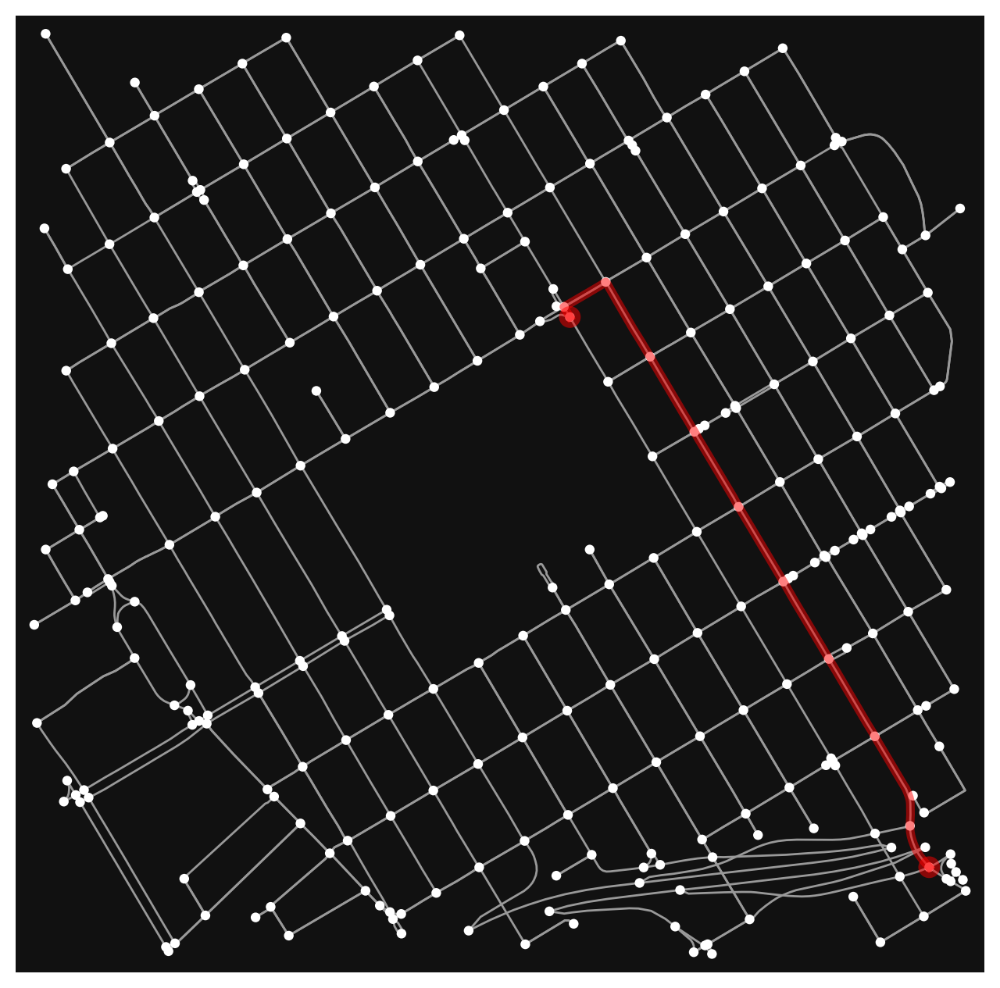
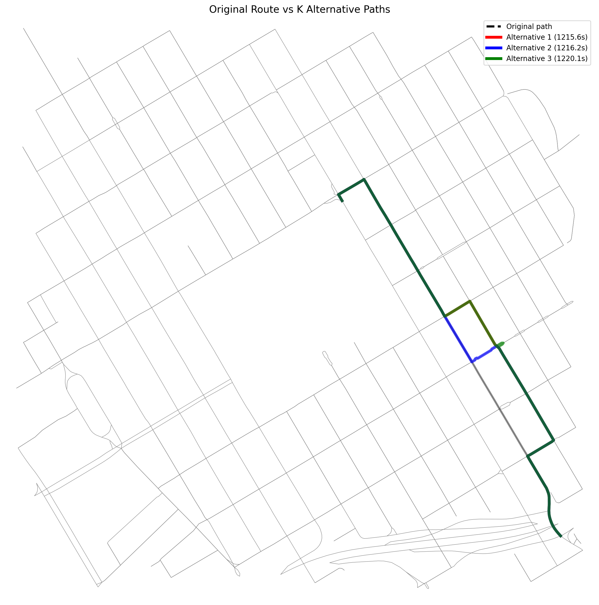

# Route Replanning Project

A full-stack dynamic route replanning system built on real-world road network data. The backend computes shortest paths and simulates traffic congestion using graph algorithms; the mobile app visualizes routes, animates a driving simulation, and presents rerouting options through a driver-friendly interface.

---

## Overview

| Layer     | Technology                       | Role                                         |
| --------- | -------------------------------- | -------------------------------------------- |
| Algorithm | Python · OSMnx · NetworkX        | Graph construction, Dijkstra, Yen's K-SP     |
| Backend   | FastAPI                          | REST API, congestion pipeline, graph caching |
| Mobile    | React Native · react-native-maps | Map UI, driving simulation, route selection  |

---

## Features

- Construct real-world road graphs from OpenStreetMap via OSMnx
- Shortest path via Dijkstra's algorithm (custom implementation)
- K alternative paths via Yen's K-Shortest Paths algorithm
- Congestion simulation by scaling edge travel-time weights
- Three-level graph caching (memory → file → OSMnx) for fast repeated demos
- FastAPI backend with startup preloading — route ready before first request
- React Native mobile app with:
  - 4-color congestion visualization (clear / light / moderate / heavy)
  - Animated driving simulation with speed proportional to congestion level
  - **Sudden jam reveal**: ahead segments turn dark red mid-drive to simulate unexpected congestion
  - **Two-step route selection**: tap to preview, then confirm — prevents accidental reroutes
  - **Driver-friendly countdown**: 10s auto-continue on current route if no action taken; pauses when passenger is actively deciding
  - Arrival summary showing time saved vs. congested route
  - Live progress bar and gray trail overlay on traveled path
  - Separate lighter color scheme for alternative routes

---

## Project Structure

```
route-replanning-project/
├── backend/
│   ├── app.py          # FastAPI app, CORS, startup graph preload
│   ├── schemas.py      # Pydantic request / response models
│   └── service.py      # Route pipeline + three-level graph cache
│
├── mobile/
│   └── src/
│       ├── config/
│       │   └── api.js                       # Base URL config
│       ├── hooks/
│       │   └── useDrivingSimulation.js      # Driving animation state machine
│       ├── navigation/
│       │   └── AppNavigator.js
│       ├── screens/
│       │   ├── HomeScreen.js                # Demo launch screen
│       │   └── MapScreen.js                 # Map + simulation UI
│       ├── services/
│       │   └── routeService.js              # API call
│       └── utils/
│           └── congestionSimulation.js      # All congestion logic: patterns, speeds, segment math, alt route generator
│
├── src/
│   ├── graph_utils.py
│   ├── dijkstra.py
│   ├── congestion.py
│   ├── yen_ksp.py
│   ├── reroute_demo.py
│   └── final_demo.py
│
├── tests/
│   └── yen_test.py
│
├── notebooks/
│   └── 01_osmnx_setup.ipynb
│
└── README.md
```

---

## Getting Started

### Prerequisites

- Python 3.10+
- Node.js 18+
- Expo Go app (iOS or Android) for mobile testing

---

### Backend

```bash
# Create and activate virtual environment
python3 -m venv .venv
source .venv/bin/activate

# Install dependencies
pip install fastapi uvicorn osmnx networkx

# Start the server
python3 -m uvicorn backend.app:app --reload --host 0.0.0.0 --port 8000
```

The API will be available at `http://localhost:8000`.  
Swagger docs: `http://localhost:8000/docs`

> **Graph caching:** On first run, the server downloads the road network from OpenStreetMap (~30s) and saves it to `backend/graph_cache.pkl`. All subsequent runs load from the file cache (~2s) or memory (instant). The cache file is excluded from version control.

---

### Mobile

```bash
cd mobile

# Install dependencies
npm install

# Start Expo dev server with tunnel
npx expo start --tunnel
```

Scan the QR code with **Expo Go** (iOS or Android). The `--tunnel` flag exposes the dev server over the internet via a public URL, so your phone does not need to be on the same Wi-Fi network as your computer.

> **Note:** Make sure the backend server is running and reachable before scanning the QR code. Update `mobile/src/config/api.js` with your backend's URL if needed.

---

## Demo Flow

1. **Start** — HomeScreen shows the fixed route (Evergreen, East San Jose → SJC Airport) and a "What to expect" summary
2. **Driving** — The car moves along the route; blue and orange segments indicate normal traffic
3. **Jam reveal** — At ~20% of the route, ahead segments suddenly turn dark red; a warning banner appears and the car pauses for 2 seconds
4. **Route selection** — Two alternative routes are shown as dashed lines on the map; tap one to preview, then tap **Confirm** to reroute, or let the 10-second countdown auto-continue on the original route
5. **Arrival** — Shows distance, estimated time, and minutes saved if an alternative was taken

---

## API Reference

### `POST /api/routes/replan`

Compute the shortest path between two points and return congestion-aware route data.

**Request body**

```json
{
  "start_address": "Evergreen, East San Jose, CA",
  "end_address": "San Jose Mineta International Airport, San Jose, CA",
  "dist": 12000,
  "k": 3,
  "congestion_start_index": 1,
  "congestion_end_index": 4,
  "congestion_multiplier": 50
}
```

**Response**

```json
{
  "source": 123456,
  "target": 789012,
  "original_path": [123456, "..."],
  "original_cost": 1142.5,
  "original_node_count": 87,
  "original_coordinates": [{ "lat": 37.294, "lon": -121.78 }, "..."],
  "original_distance_miles": 9.84,
  "original_duration_minutes": 19.0,
  "alternative_paths": [],
  "did_route_change": false
}
```

---

## Algorithms

### Dijkstra's Algorithm

Computes the minimum travel-time path on a weighted directed graph. Edge weights are derived from road length and speed limit via OSMnx.

### Yen's K-Shortest Paths

Generates up to K loopless alternative routes. Each candidate is found by iteratively penalizing spur paths from previously discovered routes, ensuring path diversity.

### Congestion Simulation

Selected edges have their `travel_time` weight multiplied by a configurable `congestion_multiplier`. The mobile app simulates this visually by replacing the normal color pattern with a dark-red jammed pattern mid-drive, then prompting the passenger to choose an alternative route.

---

## Visualization

<table>
  <tr>
    <td></td>
    <td></td>
  </tr>
  <tr>
    <td align="center">Original Route</td>
    <td align="center">Rerouted Path after Congestion</td>
  </tr>
  <tr>
    <td></td>
    <td></td>
  </tr>
  <tr>
    <td align="center">Best Alternative Route</td>
    <td align="center">K Shortest Paths Comparison</td>
  </tr>
</table>

---

## Running Tests

```bash
python3 tests/yen_test.py
```

---

## Authors

Yixun Li
